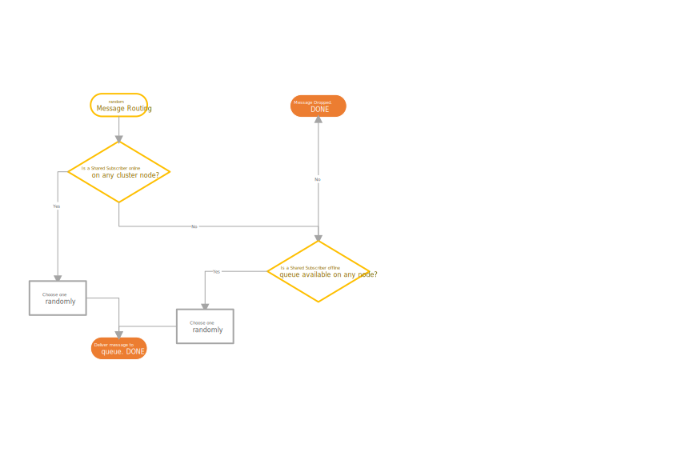
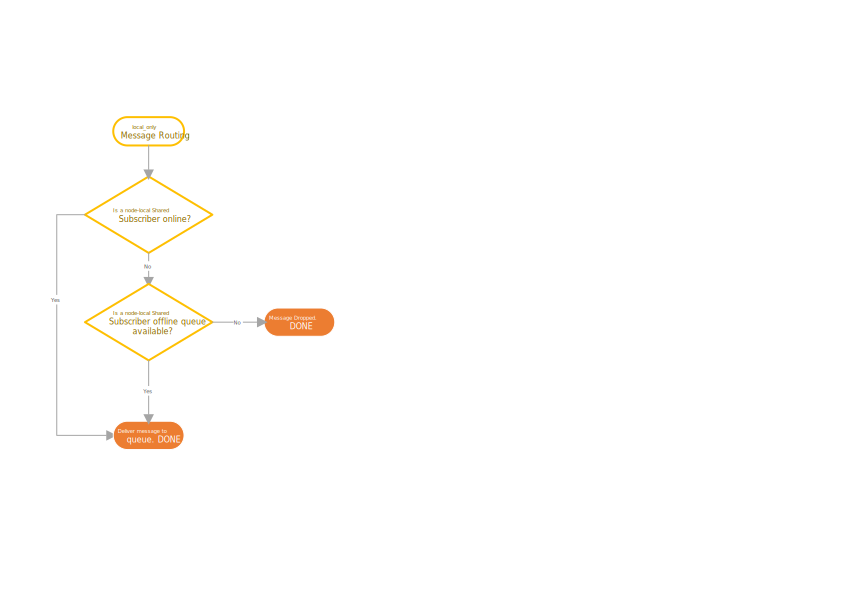
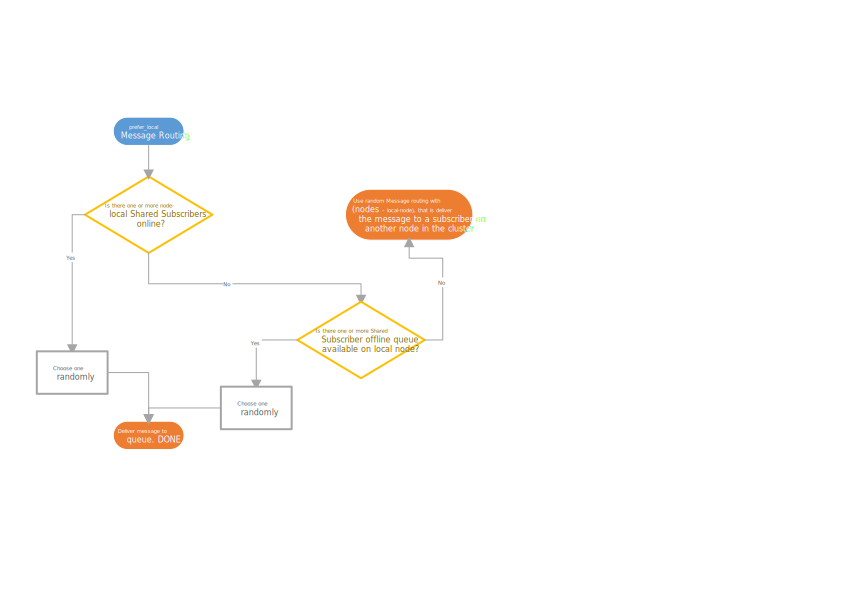

# Shared subscriptions

A shared subscription is a mechanism for distributing messages to a set of subscribers to shared subscription topic, such that each message is received by only one subscriber. This contrasts with normal subscriptions where each subscriber will receive a copy of the published message.

A shared subscription is on the form `$share/sharename/topic` and subscribers to this topic will receive messages published to the topic `topic`. The messages will be distributed according to the defined distribution policy.

The MQTT spec only defines shared subscriptions for protocol version 5. VerneMQ supports shared subscription for v5 (as per the specification) and for v3.1.1 (backported feature).


When subscribing to a shared subscription using command line tools remember to quote the topic as some command line shells, like `bash`, will otherwise expand the `$share` part of the topic as an environment variable.


## Configuration

Currently four message distribution policies for shared subscriptions are supported: `prefer_local`, `random`, `local_only` and `prefer_online_before_local`. Under the `random` policy messages will be published to a random member of the shared subscription, if any exist. Under the `prefer_local` policy messages will be delivered to a random node-local member of the shared subscription, if none exist, the message will be delivered to a random member of the shared subscription on a remote cluster node. The `prefer_online_before_local` policy works similar to `prefer_local`, but will look for an online subscriber on a non-local node, if there are only offline subscribers on the local one. Under the `local_only` policy message will be delivered to a random node-local member of the shared subscription.

```text
shared_subscription_policy = prefer_local
```

When a messages is being delivered to subscribers of a shared subscription, the message will be delivered to an online subscriber if possible, otherwise the message will be delivered to an offline subscriber.








Note that Shared Subscriptions still fully operate under the MQTT specification \(be it MQTT 5.0 or backported to older protocol versions\). Be aware of this, especially regarding QoS and clean\_session configurations. This also means that there is no shared offline message queue for all clients, but each client has its own offline message queue. MQTT v5 shared subscriptions thus have a different behaviour than e.g. Kafka where consumers read from a single shared message queue.


## Examples

**Subscriptions** _Note: When subscribing to a shared topic, make sure to escape the_ `$`

So, for dash or bash shells

```bash
mosquitto_sub -h mqtt.example.io -p 1883 -q 2 -t \$share/group/topicname
mosquitto_sub -h mqtt.example.io -p 1883 -q 2 -t \$share/group/topicname/#
```

**Publishing** _Note: When publishing to a shared topic, do not include the prefix_ `$share/group/` _as part of the publish topic name_

```bash
mosquito_pub -h mqtt.example.io -p 1883 -t topicname -m "This is a test message"
mosquito_pub -h mqtt.example.io -p 1883 -t topicname/group1 -m "This is a test message"
```

