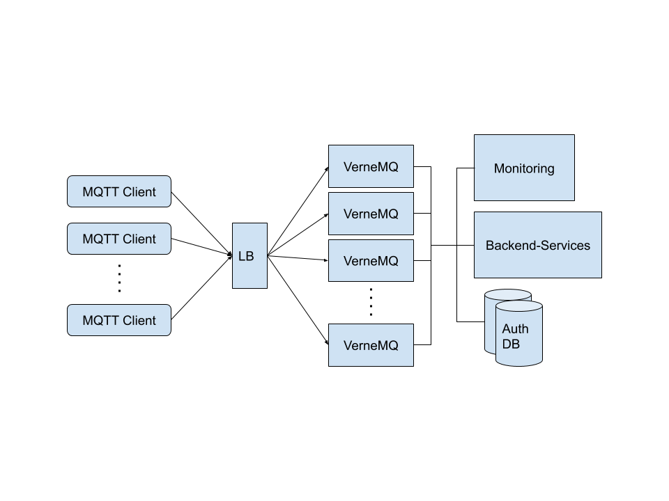

# A typical VerneMQ deployment

A typical VerneMQ deployment could from a high level look like the following:



In this scenario MQTT clients connect from the internet and are authenticated and authorized against the Authentication Management Service and publish and receive messages, either with each other or with the Backend-Services which might be responsible for sending control messages to the clients or storing and forwarding messages to other systems or databases for later processing.

To build and deploy a system such as the above a lot of decisions has to be made. These can concern how to do authentication and authorization, where to do TLS termination, how the load balancer should be configured \(if one is needed at all\), what the MQTT architecture and topic trees should look and how and to what level the system can/should scale. To simplify the following discussion we'll set a few requirements:

* Clients connecting from the internet are using TLS client certificates
* The messaging pattern is largely fan-in: The clients continuously publish a lot of messages to a set of topics which have to be handled by the Backend-Services.
* The client sessions are persistent, which means the broker will store QoS 1 & 2 messages routed to the clients while the clients are offline.

In the following we'll cover some of these options and concerns. 

### Load Balancers and the PROXY Protocol

Often a load balancer is deployed between MQTT clients and the VerneMQ cluster. One of the main purposes of the load balancer is to ensure that client connections are distributed between the VerneMQ nodes so each node has the same amount of connections. Usually a load balancer provides different load balancing strategies for deciding how to select the node where it should route an incoming connection. Examples of these are random, source hashing \(based on source IP\) or even protocol-aware balancing based on for example the MQTT client-id. The last two are examples of sticky balancing or session affine strategies where a client will always be routed to the same cluster node as long as the source IP or client-id remains the same.

When using a load balancer the client is no longer directly connected to the VerneMQ nodes and therefore the peer port and IP-address VerneMQ sees is therefore not that of the client, but of the load balancer. The peer information is often important for logging reasons or if a plugin checks it up against a white/black list.

To solve this problem VerneMQ supports the [PROXY Protocol](http://www.haproxy.org/download/1.8/doc/proxy-protocol.txt) v1 and v2 which is designed to transport connection information across proxies. See [here](../configuration/listeners.md#proxy-protocol) how to enable the proxy protocol for an MQTT listener. In case TLS is terminated at the load balancer and client certificates are used PROXY Protocol \(v2\) will also take care of forwarding TLS client certificate details.

### Client certificates and authentication

Often if client certificates are used to verify and authenticate the clients. VerneMQ makes it possible to make the client certificate common name \(CN\) available for the authentication plugin system by overriding the MQTT username with the CN, before authentication is performed. If TLS is terminated at the load balancer then the PROXY Protocol would be used. This works for both if TLS is terminated in a load balancer or if TLS is terminated directly in VerneMQ. In case TLS is terminated at the load balancer then the listener can be configured as follows to achieve this effect:

```text
listener.tcp.proxy_protocol = on
listener.tcp.proxy_protocol_use_cn_as_username = on
```

If TLS is terminated directly in VerneMQ the PROXY protocol isn't needed as the TLS client certificate is directly available in VerneMQ and the CN can be used to instead of the username by setting:

```text
listener.ssl.require_certificate = on
listener.ssl.use_identity_as_username = on
```

See the details in the [MQTT listener](../configuration/listeners.md) section.

The actual authentication can then be handled by an authentication and authorization plugin like [vmq\_diversity](../configuration/db-auth.md) which supports [PostgreSQL](https://www.postgresql.org/), [CockroachDB](https://www.cockroachlabs.com/), [MongoDB](https://www.mongodb.com/), [Redis](https://redis.io/) and [MySQL](https://www.mysql.com/) as backends for storing credentials and ACL rules.

### Monitoring and Alerting

Another important aspect of running a VerneMQ is having proper monitoring and alerting in place. All the usual things should be monitored at the OS level such as memory and cpu usage and alerts should be put in place to actions can be taken if a disk is filling up or a VerneMQ node is starting to use too much CPU. VerneMQ exports a large number of metrics and depending on the use case these can be used as important indicators that the system is running

### Performance considerations

When designing a system like the one described here, there are a number of things to consider in order to get the best performance out of the available resources.

#### Lower load through session affine load balancing

As mentioned earlier clients in this scenario are using persistent sessions. In VerneMQ a persistent session exists only on the VerneMQ node where the client connected. This implies that if the client using a persistent session later reconnects to another node, then the session, including any offline messages, will be moved to the new node. This has a certain overhead and can be avoided if the load balancer in front of VerneMQ is using a session affine load balancing strategy such as IP source hashing to assign the client connecting to a node. Of course this strategy isn't perfect if clients often change their IP addresses, but for most cases it is a huge improvement over a random load balancing strategy.

#### Handling large fan-ins

In many systems the MQTT clients provide a lot of data by periodically broadcasting data to the MQTT cluster. The amount of published messages can very easily become hard to manage for a single MQTT client. Further using normal MQTT subscriptions all subscribers would receive the same messages, so adding more subscribers to a topic doesn't help handling the amount of messages. To solve this VerneMQ implements a concept called [shared subscriptions](../configuration/shared_subscriptions.md) which makes it possible to distribute MQTT messages published to a topic over several MQTT clients. In this specific scenario this would mean the Backend-Services would consist of a set of clients subscribing to cluster nodes using shared subscriptions. 

To avoid expensive intra-node communication, VerneMQ shared subscriptions support a policy called `local_only` which means that messages being will be delivered to shared subscribers on the local node only and not forwarded to shared subscribers on other nodes in the cluster. With this policy messages for the backend-services can be delivered in the fastest and most expedient manner with the lowest overhead. See the [shared subscriptions](../configuration/shared_subscriptions.md) documentation for more information. 

#### Tuning buffer sizes

Controlling TCP buffer sizes is important in ensuring optimal memory usage. The rule is that the more bandwidth or the lower latency required, the larger the TCP buffer sizes should be. Many IoT communicate with a very low bandwidth and as such the server side TCP buffer sizes for these does not need to be very large. On the other hand, in this scenario the consumers handling the fan-ins in the Balanced-Services will have many \(thousands or tens of thousands of messages per second\) and they can benefit from larger TCP buffer sizes. Read more about tuning TCP buffer sizes [here](not-a-tuning-guide.md#tcp-buffer-sizes).

### Protecting from overload

An important guideline in protecting a VerneMQ cluster from overload is to allow only what is necessary. This means having and enforcing sensible authentication and authorization rules as well as configuring conservatively so resources cannot be exhausted due to human error or MQTT clients that have turned malicious. For example in VerneMQ it is possible to specify how many offline messages a persistent session can maximally hold via the `max_offline_messages` setting - and it should then be set to the lowest acceptable value which works for all clients and/or use a plugin which is able to override such settings on a per-client basis. The load balancer can also play an important role in protecting the system in that it can control the connect rates as well as imposing bandwidth restrictions on clients.

### Deploying a VerneMQ cluster

Somehow a system like this has to be deployed. How to do this will not be covered here, bit it is certainly possible to deploy VerneMQ using tools like[ Ansible](https://www.ansible.com/), [Chef](https://www.chef.io/products/chef-infra/) or [Puppet](https://puppet.com/) or use container solutions such as Kubernetes. For more information on how to deploy VerneMQ on Kubernetes check out our guide: [VerneMQ on Kubernetes](vernemq-on-kubernetes.md).


