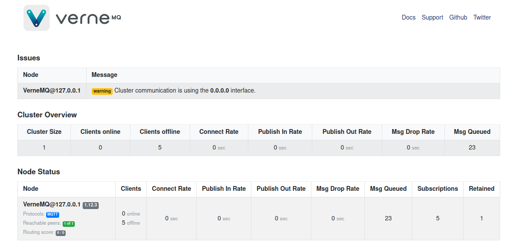

# Status Page

VerneMQ comes with a built-in status page that is enabled by default and is available on `http://localhost:8888/status`, see [HTTP listeners](../configuring-vernemq/http-listeners.md).

The status page is a simple overview of the cluster and the individual nodes in the cluster as seen below. Note that while the Status Page is running on each node of the cluster, it's enough to look at one of them to get a quick status of your cluster.

The Status Page has the following sections:

- Issues (Warnings on netsplits, etc)
- Cluster Overview
- Node Status

The Status Page will automatically refresh itself every 10 seconds, and try to calculate rates in Javascript, based on that reload window. Therefore, the displayed rates might be slightly inaccurate.
The Status Page should not be considered a replacement for a metrics system. Running in production, you certainly want to hook up VerneMQ to a metrics system like Prometheus.

