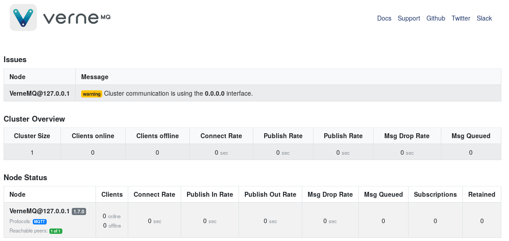

# Status Page

VerneMQ comes with a built-in status page which by default is enabled and is available on `http://localhost:8888/status`, see [HTTP listeners](../configuration/http-listeners.md).

The status page is a simple overview of the cluster and the individual nodes in the cluster as seen below:

