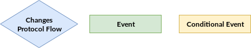
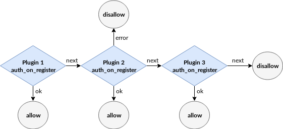
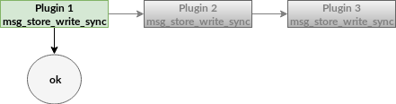

# Introduction

VerneMQ is implemented in Erlang OTP and therefore runs on top of the Erlang VM. For this reason plugins have to be developed in a programming language that runs on the Erlang VM. The most popular choice is obviously the Erlang programming language itself, but Elixir or Lisp flavoured Erlang LFE could be used too.


Be aware that in VerneMQ a plugin does NOT run in a sandboxed environment and misbehaviour could seriously harm the system \(e.g. performance degradation, reduced availability as well as consistency, and message loss\). Get in touch with us in case you require a review of your plugin.


This guide explains the different flows that expose different hooks to be used for custom plugins. It also describes the code structure a plugin must comply to in order to be successfully loaded and started by the VerneMQ plugin mechanism.

All the hooks that are currently exposed fall into one of three categories.




1. Hooks that allow you to change the protocol flow. An example could be to
   authenticate a client using the `auth_on_register` hook.

2. Hooks that inform you about a certain action, that could be used for
   example to implement a custom logging or audit plugin.

3. Hooks that are called given a certain condition

Before going into the details, let's give a quick intro to the VerneMQ plugin system.

### Plugin System

The VerneMQ plugin system allows you to load, unload, start and stop plugins during runtime, and you can even upgrade a plugin during runtime. To make this work it is required that the plugin is an OTP application and strictly follows the rules of implementing the Erlang OTP application behaviour. It is recommended to use the `rebar3` toolchain to compile the plugin. VerneMQ comes with built-in support for the directory structure used by `rebar3`.

Every plugin has to describe the hooks it is implementing as part of its application environment file. The `vmq_acl` plugin for instance comes with the application environment file below:

```erlang
{application, vmq_acl,
 [
  {description, "Simple File based ACL for VerneMQ"},
  {vsn, git},
  {registered, []},
  {applications, [
                  kernel,
                  stdlib,
                  clique
                 ]},
  {mod, { vmq_acl_app, []}},
  {env, [
      {file, "priv/test.acl"},
      {interval, 10},
      {vmq_config_enabled, true},
      {vmq_plugin_hooks, [
            {vmq_acl, change_config, 1, [internal]},
            {vmq_acl, auth_on_publish, 6, []},
            {vmq_acl, auth_on_subscribe, 3, []}
        ]}
    ]}
 ]}.
```

Lines 6 to 10 instruct the plugin system to ensure that those dependent applications are loaded and started. If you're using third party dependencies make sure that they are available in compiled form and part of the plugin load path. Lines 16 to 20 allow the plugin system to compile the plugin rules. Yes, you've heard correctly. The rules are compiled into Erlang VM code to make sure the lookup and execution of plugin code is as fast as possible. Some hooks exist which are used internally such as the `change_config/1`, we'll describe those at some other point.

The environment value for `vmq_plugin_hooks` is a list of hooks. A hook is specified by `{Module, Function, Arity, Options}`.

To streamline the plugin development we provide a different Erlang behaviour for every hook a plugin implements. Those behaviours are part of the `vernemq_dev` library application, which you should add as a dependency to your plugin. `vernemq_dev` also comes with a header file that contains all the type definitions used by the hooks.

#### Chaining

It is possible to have multiple plugins serving the same hook. Depending on the hook the plugin chain is used differently. The most elaborate chains can be found for the hooks that deal with authentication and authorization flows. We also call them _conditional chains_ as a plugin can give control away to the next plugin in the chain. The image show a sample plugin chain for the `auth_on_register` hook.



Most hooks don't require conditions and are mainly used as event handlers. In this case all plugins in a chain are called. An example for such a hook would be the `on_register` hook.


A rather specific case is the need to call only one plugin instead of iterating through the whole chain. VerneMQ uses such hooks for it's pluggable message storage system.



Unless you're implementing your custom message storage backend, you probably won't need this style of hook.


The position in the plugin call chain is currently implicitly given by the order the plugins have been started.


#### Startup

The plugin mechanism uses the application environment file to infer the applications that it has to load and start prior to starting the plugin itself. It internally uses the `application:ensure_all_started/1` function call to start the plugin. If your setup is more complex you could override this behaviour by implementing a custom `start/0` function inside a module that's named after your plugin.

#### Teardown

The plugin mechanism uses `application:stop/1` to stop and unload the plugin. This won't stop the dependent application started at startup. If you rely on third party applications that aren't started as part of the VerneMQ release, e.g. a database driver, you can implement a custom `stop/0` function inside a module that's named after your plugin and properly stop the driver there.

### Public Type Specs

The `vmq_types.hrl` exposes all the type specs used by the hooks. The following types are used by the plugin system:

```erlang
-type peer()                :: {inet:ip_address(), inet:port_number()}.
-type username()            :: binary() | undefined.
-type password()            :: binary() | undefined.
-type client_id()           :: binary().
-type mountpoint()          :: string().
-type subscriber_id()       :: {mountpoint(), client_id()}.
-type reg_view()            :: atom().
-type topic()               :: [binary()].
-type qos()                 :: 0 | 1 | 2.
-type routing_key()         :: [binary()].
-type payload()             :: binary().
-type flag()                :: boolean().
```

