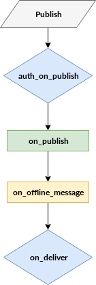

# Publish Flow

In this section the publish flow is described. VerneMQ provides multiple hooks throughout the flow of a message. The most important one is the `auth_on_publish` which acts as an application level firewall granting or rejecting a publish message.



### auth\_on\_publish

The `auth_on_publish` hook allows your plugin to grant or reject publish requests sent by a client. It also enables to rewrite the publish topic, payload, qos, or retain flag. The hook is specified in the Erlang behaviour `auth_on_publish_hook` available in `vernemq_dev`.

```erlang
-module(auth_on_publish_hook).
-include("vmq_types.hrl").

-type msg_modifier() :: {topic, topic()}
                      | {payload, payload()}
                      | {reg_view, reg_view()}
                      | {qos, qos()}
                      | {retain, flag()}
                      | {mountpoint, mountpoint()}.

%% called as an all_till_ok - hook
-callback auth_on_publish(UserName      :: username(),
                          SubscriberId  :: subscriber_id(),
                          QoS           :: qos(),
                          Topic         :: topic(),
                          Payload       :: payload(),
                          IsRetain      :: flag()
                          ) -> ok
                               | {ok, Payload    :: payload()}
                               | {ok, Modifiers  :: [msg_modifier()]}
                               | {error, Reason  :: any()}
                               | next.
```

Every plugin that implements the `auth_on_publish` hook is part of a conditional plugin chain. For this reason we allow the hook to return different values. In case the plugin can't validate the publish message it is best to return `next` as this would allow subsequent plugins in the chain to validate the request. If no plugin is able to validate the request it gets automatically rejected.

### on\_publish

The `on_publish` hook allows your plugin to get informed about an authorized publish message. The hook is specified in the Erlang behaviour `on_publish_hook` available in `vernemq_dev`.

```erlang
-module(on_publish_hook).
-include("vmq_types.hrl").

%% called as an 'all'-hook, return value is ignored
-callback on_publish(UserName      :: username(),
                     SubscriberId  :: subscriber_id(),
                     QoS           :: qos(),
                     Topic         :: topic(),
                     Payload       :: payload(),
                     IsRetain      :: flag()) -> any().
```

### on\_offline\_message

The `on_offline_message` hook allows your plugin to get notified about a new a queued message for a client that is currently offline. The hook is specified in the Erlang behaviour `on_offline_message_hook` available in `vernemq_dev`.

```erlang
-module(on_offline_message_hook).
-include("vmq_types.hrl").

%% called as an 'all'-hook, return value is ignored
-callback on_offline_message(SubscriberId  :: subscriber_id(),
                             QoS           :: qos(),
                             Topic         :: topic(),
                             Payload       :: payload(),
                             IsRetain      :: flag()) -> any().
```

### on\_deliver

The `on_deliver` hook allows your plugin to get informed about outgoing publish messages, but also allows you to rewrite topic and payload of the outgoing message. The hook is specified in the Erlang behaviour `on_deliver_hook` available in `vernemq_dev`.

```erlang
-module(on_deliver_hook).
-include("vmq_types.hrl").
-type msg_modifier() :: {topic, topic()}
                      | {payload, payload()}.

%% called as an all_till_ok - hook
-callback on_deliver(UserName      :: username(),
                     SubscriberId  :: subscriber_id(),
                     Topic         :: topic(),
                     Payload       :: payload()
                     ) -> ok
                           | {ok, Payload    :: payload()}
                           | {ok, Modifiers  :: [msg_modifier()]}
                           | next.
```

Every plugin that implements the `on_deliver` hook is part of a conditional plugin chain, although NO verdict is required in this case. The message gets delivered in any case. If your plugin uses this hook to rewrite the message the plugin system stops evaluating subsequent plugins in the chain.

