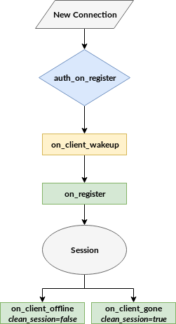

# Session lifecycle

VerneMQ provides multiple hooks throughout the lifetime of a session. The most important one is the `auth_on_register`which acts as an application level firewall granting or rejecting new clients.



### auth\_on\_register

The `auth_on_register` hook allows your plugin to grant or reject new client connections. Moreover it lets you exert fine grained control over the configuration of the client session. The hook is specified in the Erlang behaviour `auth_on_register_hook` available in `vernemq_dev`.

```erlang
-module(auth_on_register_hook).
-include("vmq_types.hrl").

-type reg_modifiers()   :: {subscriber_id, subscriber_id()}
                         | {reg_view, reg_view()}
                         | {clean_session, flag()}
                         | {max_message_size, non_neg_integer()}
                         | {max_message_rate, non_neg_integer()}
                         | {max_inflight_messages, non_neg_integer()}
                         | {retry_interval, pos_integer()}
                         | {upgrade_qos, boolean()}.

%% called as an all_till_ok hook
-callback auth_on_register(Peer          :: peer(),
                           SubscriberId  :: subscriber_id(),
                           UserName      :: username(),
                           Password      :: password(),
                           CleanSession  :: flag()
                           ) -> ok
                                | {ok, [reg_modifiers()]}
                                | {error, invalid_credentials | any()}
                                | next.
```

Every plugin that implements the `auth_on_register` hook is part of a conditional plugin chain. For this reason we allow the hook to return different values depending on how the plugin grants or rejects this client. In case the plugin doesn't know the client it is best to return `next` as this would allow subsequent plugins in the chain to validate this client. If no plugin is able to validate the client it gets automatically rejected.

### on\_register

The `on_register` hook allows your plugin to get informed about a newly authenticated client. The hook is specified in the Erlang behaviour `on_register_hook` available in `vernemq_dev`.

```erlang
-module(on_register_hook).
-include("vmq_types.hrl").

%% called as an 'all' hook, return value is ignored
-callback on_register(Peer          :: peer(),
                      SubscriberId  :: subscriber_id(),
                      UserName      :: username()) -> any().
```

### on\_client\_wakeup

Once a new client was successfully authenticated and the above described hooks have been called, the client attaches to its queue. If it is a returning client using `clean_session=false` or if the client had previous sessions in the cluster, this process could take a while. \(As offline messages are migrated to a new node, existing sessions are disconnected\). The `on_client_wakeup` hook is called at the point where a queue has been successfully instantiated, possible offline messages migrated, and potential duplicate sessions have been disconnected. In other words: when the client has reached a completely initialized, normal state for accepting messages. The hook is specified in the Erlang behaviour `on_client_wakeup_hook` available in `vernemq_dev`.

```erlang
-module(on_client_wakeup_hook).
-include("vmq_types.hrl").

%% called as an 'all'-hook, return value is ignored
-callback on_client_wakeup(SubscriberId  :: subscriber_id()) -> any().
```

### on\_client\_offline

This hook is called if a client using `clean_session=false` closes the connection or gets disconnected by a duplicate client. The hook is specified in the Erlang behaviour `on_client_offline_hook` available in `vernemq_dev`.

```erlang
-module(on_client_offline_hook).
-include("vmq_types.hrl").

%% called as an 'all'-hook, return value is ignored
-callback on_client_offline(SubscriberId  :: subscriber_id()) -> any().
```

### on\_client\_gone

This hook is called if a client using `clean_session=true` closes the connection or gets disconnected by a duplicate client. The hook is specified in the Erlang behaviour `on_client_gone_hook` available in `vernemq_dev`.

```erlang
-module(on_client_gone_hook).
-include("vmq_types.hrl").

%% called as an 'all'-hook, return value is ignored
-callback on_client_gone(SubscriberId  :: subscriber_id()) -> any().
```

