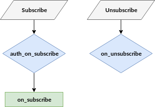

# Subscribe Flow

In this section the subscription flow is described. VerneMQ provides several hooks to intercept the subscription flow. The most important one is the `auth_on_subscribe` which acts as an application level firewall granting or rejecting subscribe requests.



### auth\_on\_subscribe

The `auth_on_subscribe` hook allows your plugin to grant or reject subscribe requests sent by a client. It also enables to rewrite the subscribe topic and qos. The hook is specified in the Erlang behaviour `auth_on_subscribe_hook` available in `vernemq_dev`.

```erlang
-module(auth_on_subscribe_hook).
-include("vmq_types.hrl").

%% called as an all_till_ok - hook
-callback auth_on_subscribe(UserName      :: username(),
                            SubscriberId  :: subscriber_id(),
                            Topics        :: [{Topic :: topic(), QoS :: qos()}]
                            ) -> ok
                                 | {ok, [{Topic :: topic(), Qos :: qos()}]}
                                 | {error, Reason :: any()}
                                 | next.
```

### on\_subscribe

The `on_subscribe` hook allows your plugin to get informed about an authorized subscribe request. The hook is specified in the Erlang behaviour `on_subscribe_hook` available in `vernemq_dev`.

```erlang
-module(on_subscribe_hook).
-include("vmq_types.hrl").

%% called as an 'all'-hook, return value is ignored
-callback on_subscribe(UserName      :: username(),
                       SubscriberId  :: subscriber_id(),
                       Topics        :: [{Topic :: topic(), QoS :: qos()}]) -> any().
```

### on\_unsubscribe

The `on_unsubscribe` hook allows your plugin to get informed about an unsubscribe request. It also allows you to rewrite the unsubscribe topic if required. The hook is specified in the Erlang behaviour `on_unsubscribe_hook` available in `vernemq_dev`.

```erlang
-module(on_unsubscribe_hook).
-include("vmq_types.hrl").

%% called as an 'all_till_ok'-hook
-callback on_unsubscribe(UserName      :: username(),
                         SubscriberId  :: subscriber_id(),
                         Topics        :: [Topic :: topic()]
                         ) -> ok
                              | {ok, [Topic :: topic()]}
                              | next.
```

