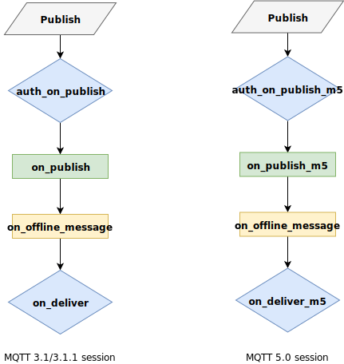

# Publish Flow

In this section the publish flow is described. VerneMQ provides multiple hooks
throughout the flow of a message. The most important ones are the
`auth_on_publish` and `auth_on_publish_m5` hooks which acts as an application
level firewall granting or rejecting a publish message.

### auth\_on\_publish and auth\_on\_publish\_m5

The `auth_on_publish` and `auth_on_publish_m5` hooks allow your plugin to grant
or reject publish requests sent by a client. It also enables to rewrite the
publish topic, payload, qos, or retain flag and in the case of
`auth_on_publish_m5` properties. The `auth_on_publish` hook is specified in the
Erlang behaviour
[auth_on_publish_hook](https://github.com/vernemq/vernemq_dev/blob/master/src/auth_on_publish_hook.erl)
and the `auth_on_publish_m5` hook in the
[auth_on_publish_m5_hook](https://github.com/vernemq/vernemq_dev/blob/master/src/auth_on_publish_m5_hook.erl)
behaviour available in the [vernemq_dev](https://github.com/vernemq/vernemq_dev)
repo.

Every plugin that implements the `auth_on_publish` or `auth_on_publish_m5` hooks
are part of a conditional plugin chain. For this reason we allow the hook to
return different values. In case the plugin can't validate the publish message
it is best to return `next` as this would allow subsequent plugins in the chain
to validate the request. If no plugin is able to validate the request it gets
automatically rejected.

### on\_publish and on\_publish\_m5

The `on_publish` and `on_publish_m5` hooks allow your plugin to get informed
about an authorized publish message. The hook is specified in the Erlang
behaviour
[on_publish_hook](https://github.com/vernemq/vernemq_dev/blob/master/src/on_publish_hook.erl)
and the `on_publish_m5` hook in the
[on_publish_m5_hook](https://github.com/vernemq/vernemq_dev/blob/master/src/on_publish_m5_hook.erl)
behaviour available in the [vernemq_dev](https://github.com/vernemq/vernemq_dev)
repo.

### on\_offline\_message

The `on_offline_message` hook allows your plugin to get notified about a new a
queued message for a client that is currently offline. The hook is specified in
the Erlang behaviour
[on_offline_message_hook](https://github.com/vernemq/vernemq_dev/blob/master/src/on_offline_message_hook.erl)
available in the [vernemq_dev](https://github.com/vernemq/vernemq_dev) repo.

### on\_deliver and on\_deliver\_m5

The `on_deliver` and `on_deliver_m5` hooks allow your plugin to get informed
about outgoing publish messages, but also allows you to rewrite topic and
payload of the outgoing message. The hook is specified in the Erlang behaviour
[on_deliver_hook](https://github.com/vernemq/vernemq_dev/blob/master/src/on_deliver_hook.erl)
and the `on_deliver_m5` hook in the
[on_deliver_m5_hook](https://github.com/vernemq/vernemq_dev/blob/master/src/on_deliver_m5_hook.erl)
behaviour available in the [vernemq_dev](https://github.com/vernemq/vernemq_dev)
repo.

Every plugin that implements the `on_deliver` or `on_deliver_m5` hooks are part
of a conditional plugin chain, although NO verdict is required in this case. The
message gets delivered in any case. If your plugin uses this hook to rewrite the
message the plugin system stops evaluating subsequent plugins in the chain.

