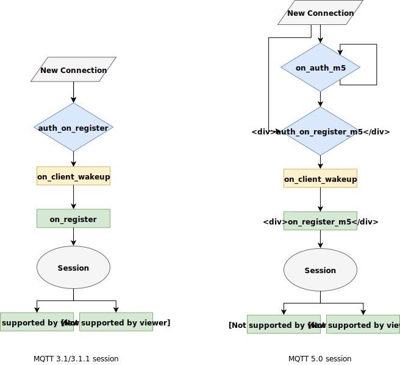

# Session lifecycle

VerneMQ provides multiple hooks throughout the lifetime of a session. The most important ones are the `auth_on_register` and `auth_on_register_m5` hooks which act as an application level firewall granting or rejecting new clients.

## auth\_on\_register and auth\_on\_register\_m5

The `auth_on_register` and `auth_on_register_m5` hooks allow your plugin to grant or reject new client connections. Moreover it lets you exert fine grained control over the configuration of the client session. The `auth_on_register` hook is specified in the Erlang behaviour [auth\_on\_register\_hook](https://github.com/vernemq/vernemq_dev/blob/master/src/auth_on_register_hook.erl) and the `auth_on_register_m5` hook in the [auth\_on\_register\_m5\_hook](https://github.com/vernemq/vernemq_dev/blob/master/src/auth_on_register_m5_hook.erl) behaviour available in the [vernemq\_dev](https://github.com/vernemq/vernemq_dev) repo.

Every plugin that implements the `auth_on_register` or `auth_on_register_m5` hooks are part of a conditional plugin chain. For this reason we allow the hook to return different values depending on how the plugin grants or rejects this client. In case the plugin doesn't know the client it is best to return `next` as this would allow subsequent plugins in the chain to validate this client. If no plugin is able to validate the client it gets automatically rejected.

## on\_auth\_m5

The `on_auth_m5` hook allows your plugin to implement MQTT enhanced authentication, see [Enhanced Authentication Flow](enhancedauthflow.md).

## on\_register and on\_register\_m5

The `on_register` and `on_register_m5` hooks allow your plugin to get informed about a newly authenticated client. The hook is specified in the Erlang behaviour [on\_register\_hook](https://github.com/vernemq/vernemq_dev/blob/master/src/on_register_hook.erl) and the [on\_register\_m5\_hook](https://github.com/vernemq/vernemq_dev/blob/master/src/on_register_m5_hook.erl) behaviour available in the [vernemq\_dev](https://github.com/vernemq/vernemq_dev) repo.

## on\_client\_wakeup

Once a new client was successfully authenticated and the above described hooks have been called, the client attaches to its queue. If it is a returning client using `clean_session=false` or if the client had previous sessions in the cluster, this process could take a while. \(As offline messages are migrated to a new node, existing sessions are disconnected\). The [on\_client\_wakeup](https://github.com/vernemq/vernemq_dev/blob/master/src/on_client_wakeup_hook.erl) hook is called at the point where a queue has been successfully instantiated, possible offline messages migrated, and potential duplicate sessions have been disconnected. In other words: when the client has reached a completely initialized, normal state for accepting messages. The hook is specified in the Erlang behaviour `on_client_wakeup_hook` available in the [vernemq\_dev](https://github.com/vernemq/vernemq_dev) repo.

## on\_client\_offline

This hook is called if an MQTT 3.1/3.1.1 client using `clean_session=false` or an MQTT 5.0 client with a non-zero `session_expiry_interval` closes the connection or gets disconnected by a duplicate client. The hook is specified in the Erlang behaviour [on\_client\_offline\_hook](https://github.com/vernemq/vernemq_dev/blob/master/src/on_client_offline_hook.erl) available in the [vernemq\_dev](https://github.com/vernemq/vernemq_dev) repo.

## on\_client\_gone

This hook is called if an MQTT 3.1/3.1.1 client using `clean_session=true` or an MQTT 5.0 client with the `session_expiry_interval` set to zero closes the connection or gets disconnected by a duplicate client. The hook is specified in the Erlang behaviour [on\_client\_gone\_hook](https://github.com/vernemq/vernemq_dev/blob/master/src/on_client_gone_hook.erl) available in the [vernemq\_dev](https://github.com/vernemq/vernemq_dev) repo.

