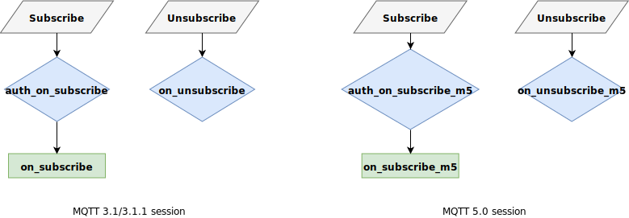

# Subscribe Flow

In this section the subscription flow is described. VerneMQ provides several hooks to intercept the subscription flow. The most important ones are the `auth_on_subscribe` and `auth_on_subscribe_m5` hooks which act as an application level firewall granting or rejecting subscribe requests.

## auth\_on\_subscribe and auth\_on\_subscribe\_m5

The `auth_on_subscribe` and `auth_on_subscribe_m5` hooks allow your plugin to grant or reject subscribe requests sent by a client. They also makes it possible to rewrite the subscribe topic and qos. The `auth_on_subscribe` hook is specified in the Erlang behaviour [auth\_on\_subscribe\_hook](https://github.com/vernemq/vernemq_dev/blob/master/src/auth_on_subscribe_hook.erl) and the `auth_on_subscribe` hook in the [auth\_on\_subscribe\_m5\_hook](https://github.com/vernemq/vernemq_dev/blob/master/src/auth_on_subscribe_m5_hook.erl) behaviour available in the [vernemq\_dev](https://github.com/vernemq/vernemq_dev) repo.

## on\_subscribe and on\_subscribe\_m5

The `on_subscribe` and `on_subscribe_m5` hooks allow your plugin to get informed about an authorized subscribe request. The `on_subscribe` hook is specified in the Erlang behaviour [on\_subscribe\_hook](https://github.com/vernemq/vernemq_dev/blob/master/src/on_subscribe_hook.erl) and the `on_subscribe_m5` hook in the [on\_subscribe\_m5\_hook](https://github.com/vernemq/vernemq_dev/blob/master/src/on_subscribe_m5_hook.erl) behaviour available in the [vernemq\_dev](https://github.com/vernemq/vernemq_dev) repo.

## on\_unsubscribe and on\_unsubscribe\_m5

The `on_unsubscribe` and `on_unsubscribe_m5` hooks allow your plugin to get informed about an unsubscribe request. They also allow you to rewrite the unsubscribe topic if required. The `on_subscribe` hook is specified in the Erlang behaviour [on\_unsubscribe\_hook](https://github.com/vernemq/vernemq_dev/blob/master/src/on_unsubscribe_hook.erl) and the `on_unsubscribe_m5` hook in the [on\_unsubscribe\_m5\_hook](https://github.com/vernemq/vernemq_dev/blob/master/src/on_unsubscribe_m5_hook.erl) behaviour available in the [vernemq\_dev](https://github.com/vernemq/vernemq_dev) repo.

